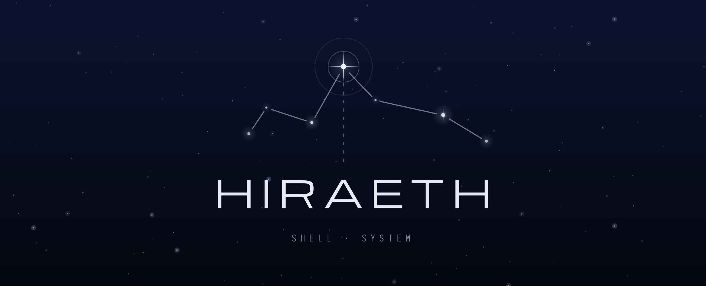
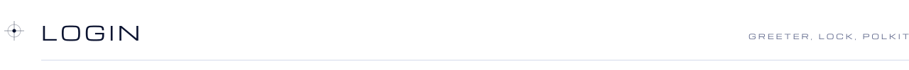
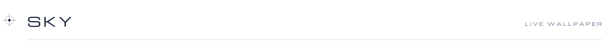
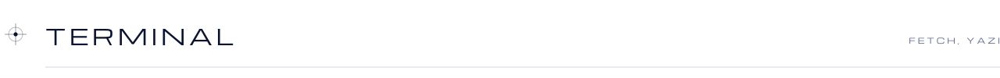
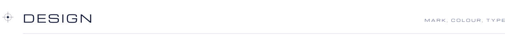
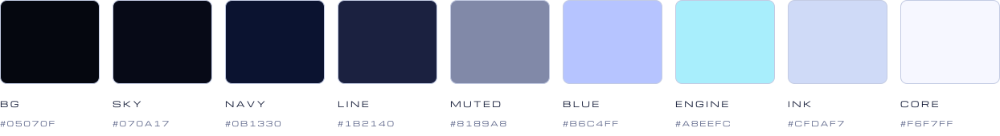
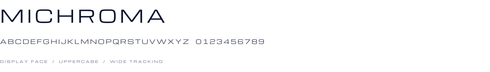

  <a href="#shell">Shell</a>&nbsp;&nbsp;·&nbsp;&nbsp;<a href="#login">Login</a>&nbsp;&nbsp;·&nbsp;&nbsp;<a href="#sky">Sky</a>&nbsp;&nbsp;·&nbsp;&nbsp;<a href="#terminal">Terminal</a>&nbsp;&nbsp;·&nbsp;&nbsp;<a href="#design">Design</a>

 

Hiraeth is my desktop for Hyprland on CachyOS. The shell, login screen, lockscreen, polkit prompt
and wallpaper share one look: a dark night sky, thin lines and a few bright stars.

*Hiraeth* is a Welsh word for homesickness for a place you can't go back to.

<a href="media/tour.mp4">Full tour, 1 min</a>&nbsp;&nbsp;·&nbsp;&nbsp;<a href="media/greeter.mp4">Greeter</a>&nbsp;&nbsp;·&nbsp;&nbsp;<a href="media/polkit-first-version.mp4">First polkit prototype</a>

| Part | What it is | Source |
| :-- | :-- | :-- |
| Shell | Quickshell config: sidebar, notch, launcher, dashboard, notifications | not public yet |
| Greeter | greetd login screen | [Hiraeth-greeter](https://github.com/SleepyCatHiraeth/Hiraeth-greeter) |
| Polkit | Authentication agent | [Hiraeth-polkit](https://github.com/SleepyCatHiraeth/Hiraeth-polkit) |
| Sky | Animated wallpaper, also behind the lockscreen | not public yet |

 

<picture><source media="(prefers-color-scheme: dark)" srcset="assets/headers/01-shell-dark.svg"></picture>

The bar sits on the left edge, the notch at the top. Everything else opens out of one of the two.

Dashboard with media, calendar, toggles and notifications

<table>
<tr>
<td width="50%"> Launcher</td>
<td width="50%"> Workspace overview</td>
</tr>
<tr>
<td> Settings and keybinds</td>
<td> Presets swap the whole setup at once</td>
</tr>
<tr>
<td> Assistant panel</td>
<td> Calendar, weather and a focus timer</td>
</tr>
<tr>
<td> Volume, mic and brightness</td>
<td> Power profile, cycled from the bar</td>
</tr>
<tr>
<td> Wallpaper picker for images, GIFs and video</td>
<td> System monitor</td>
</tr>
</table>

The notch holds the user, a Hyprland splash line and anything short-lived.

<table>
<tr>
<td width="50%"> Notch</td>
<td width="50%"> Notification</td>
</tr>
<tr>
<td> Screenshot and recording tools</td>
<td> Power menu</td>
</tr>
<tr>
<td> Volume OSD</td>
<td> Splash line</td>
</tr>
</table>

 

<picture><source media="(prefers-color-scheme: dark)" srcset="assets/headers/02-login-dark.svg"></picture>

The greeter replaces SDDM and uses whatever wallpaper the desktop has, animated ones included.
The lockscreen and the polkit prompt follow the same layout.

<table>
<tr>
<td width="50%"> Password</td>
<td width="50%"> Logging in</td>
</tr>
<tr>
<td> Desktop wallpaper carried over</td>
<td> Animated wallpaper</td>
</tr>
</table>

Lockscreen over the live sky

<table>
<tr>
<td width="50%"> The password card shows up once you type</td>
<td width="50%"> Polkit prompt</td>
</tr>
</table>

 

<picture><source media="(prefers-color-scheme: dark)" srcset="assets/headers/03-sky-dark.svg"></picture>

A wallpaper drawn live instead of a picture. Stars drift, the galaxy turns slowly, and now and
then a ship passes through.

<table>
<tr>
<td width="50%"> Home system</td>
<td width="50%"> A ship crossing, then jumping</td>
</tr>
<tr>
<td> Warp out</td>
<td> HR 1, the far light from the logo</td>
</tr>
</table>

 

<picture><source media="(prefers-color-scheme: dark)" srcset="assets/headers/04-terminal-dark.svg"></picture>

The terminal and yazi in the Hiraeth colours

fastfetch, with the logo drawn by the shell

 

<picture><source media="(prefers-color-scheme: dark)" srcset="assets/headers/05-design-dark.svg"></picture>

The logo is HIRAETH in Michroma under seven stars, one for each letter. The brightest one sits
over the A. The bar icons are small constellations drawn the same way.

<picture><source media="(prefers-color-scheme: dark)" srcset="assets/palette-dark.svg"></picture>

| Name | Hex | Used for |
| :-- | :-- | :-- |
| bg | `#05070f` | Deepest background |
| sky | `#070a17` | Wallpaper |
| navy | `#0b1330` | Panels |
| line | `#1b2140` | Borders |
| muted | `#8189a8` | Secondary text |
| blue | `#b6c4ff` | Accents, star glow |
| engine | `#a8eefc` | Active states |
| ink | `#cfdaf7` | Text and lines |
| core | `#f6f7ff` | Highlights |

 

<picture><source media="(prefers-color-scheme: dark)" srcset="assets/type-dark.svg"></picture>

 

## Credits

- [Quickshell](https://quickshell.org), the QML toolkit the shell runs on
- [Ambxst](https://github.com/Axenide/Ambxst), which the shell started as a fork of
- [Michroma](https://fonts.google.com/specimen/Michroma) by Vernon Adams, SIL Open Font License
